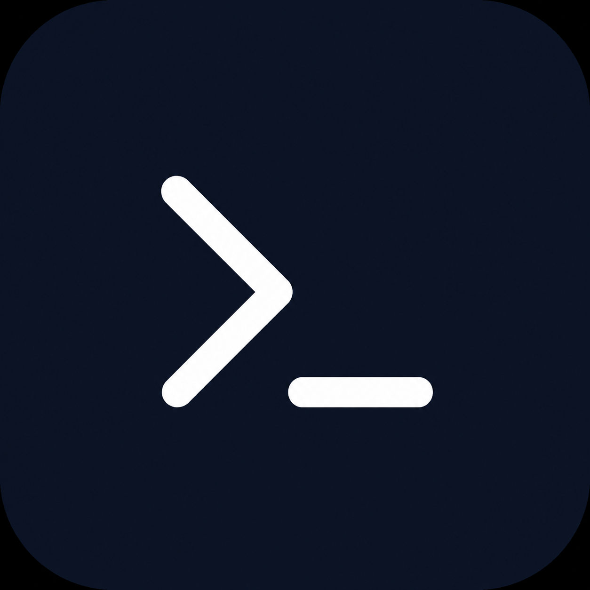

<p align="center">
  
</p>

<h1 align="center">TmarTerminal</h1>

<p align="center">
  A dark, fast, Windows-focused SSH terminal built with Tauri, React, xterm.js, and Rust.
</p>

<p align="center">
  <a href="#-русский">Русский</a>
  <span> · </span>
  <a href="#-english">English</a>
  <span> · </span>
  <a href="#-中文">中文</a>
</p>

<p align="center">
  
  
  
  
</p>

---

## 🇷🇺 Русский

**TmarTerminal** — современный SSH-терминал для Windows с темным интерфейсом, вкладками, разделением терминала, локальным PowerShell, SFTP и настраиваемыми темами.

### Возможности

- SSH-подключения по паролю и private key.
- Сохраненные подключения и импорт из `~/.ssh/config`.
- Вкладки и split-панели внутри одной вкладки.
- Локальный PowerShell рядом с SSH-сессиями.
- Встроенный SFTP: локальная и удаленная панели, upload/download, mkdir/delete/rename.
- Ping активного SSH-подключения в статус-баре.
- Настройки тем терминала, размера шрифта и хоткеев.
- Темный компактный UI в стиле desktop terminal tooling.


### Установка

Скачай последнюю сборку в разделе **Releases**:

- `TmarTerminal-portable.exe` — portable-версия.
- `TmarTerminal_0.1.0_x64-setup.exe` — обычный Windows installer.
- `TmarTerminal_0.1.0_x64_en-US.msi` — MSI installer.

### Разработка

```powershell
npm install
npm run tauri dev
```

Если Rust не видит MSVC toolchain:

```powershell
.\dev.ps1
```

### Сборка

```powershell
npm run build
cd src-tauri
cargo check
cd ..
npm run tauri build
```

> Saved connections хранятся в пользовательской config-директории в `TmarTerminal/connections.json`. Этот файл не входит в репозиторий.

---

## 🇬🇧 English

**TmarTerminal** is a modern SSH terminal for Windows with a dark desktop UI, tabs, split panes, local PowerShell, SFTP, and configurable terminal themes.

### Features

- SSH connections with password or private key authentication.
- Saved connections and `~/.ssh/config` import.
- Tabs and split panes inside a single tab.
- Local PowerShell panes next to SSH sessions.
- Built-in SFTP: local and remote panels, upload/download, mkdir/delete/rename.
- Active SSH round-trip ping in the status bar.
- Configurable terminal themes, font size, and hotkeys.
- Compact dark UI designed for repeated terminal work.

### Install

Download the latest build from **Releases**:

- `TmarTerminal-portable.exe` — portable executable.
- `TmarTerminal_0.1.0_x64-setup.exe` — Windows installer.
- `TmarTerminal_0.1.0_x64_en-US.msi` — MSI installer.

### Development

```powershell
npm install
npm run tauri dev
```

If Rust cannot find the MSVC toolchain:

```powershell
.\dev.ps1
```

### Build

```powershell
npm run build
cd src-tauri
cargo check
cd ..
npm run tauri build
```

> Saved connections are stored in the user's config directory under `TmarTerminal/connections.json`. That file is not part of the repository.

---

## 🇨🇳 中文

**TmarTerminal** 是一个面向 Windows 的现代 SSH 终端，提供深色桌面界面、标签页、分屏面板、本地 PowerShell、SFTP 和可配置终端主题。

### 功能

- 支持密码和私钥 SSH 登录。
- 支持保存连接，并可从 `~/.ssh/config` 导入。
- 支持标签页和同一标签页内的分屏面板。
- 支持在 SSH 会话旁边打开本地 PowerShell。
- 内置 SFTP：本地/远程双面板、上传/下载、创建目录、删除、重命名。
- 状态栏显示当前 SSH 连接的 round-trip ping。
- 支持配置终端主题、字体大小和快捷键。
- 深色紧凑界面，适合高频终端操作。

### 安装

请在 **Releases** 页面下载最新版本：

- `TmarTerminal-portable.exe` — 便携版可执行文件。
- `TmarTerminal_0.1.0_x64-setup.exe` — Windows 安装器。
- `TmarTerminal_0.1.0_x64_en-US.msi` — MSI 安装器。

### 开发

```powershell
npm install
npm run tauri dev
```

如果 Rust 找不到 MSVC 工具链：

```powershell
.\dev.ps1
```

### 构建

```powershell
npm run build
cd src-tauri
cargo check
cd ..
npm run tauri build
```

> 保存的连接位于用户配置目录中的 `TmarTerminal/connections.json`。该文件不会提交到仓库。
